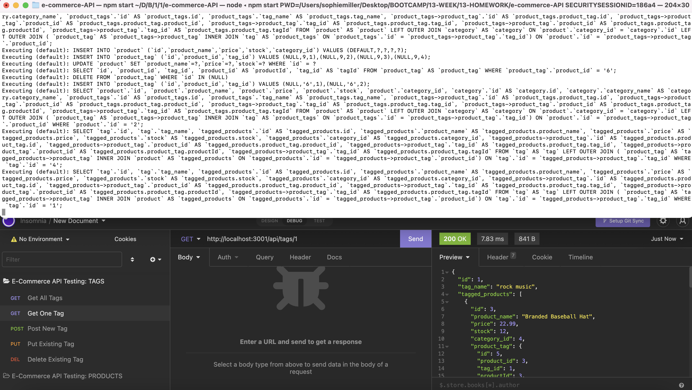

# E-Commerce API 

  

  ## Tabel of Countents
  - [Description](#description)
  - [Installation](#installation)
  - [Usage](#usage)
  - [Contributing](#contributing) 
  - [Tests](#tests)
  - [License](#license)
  - [Questions](#questions)
  
  
  ## Description
  Internet retail, also known as e-commerce, is the largest sector of the electronics industry, generating an estimated $29 trillion in 2019. E-commerce platforms like Shopify and WooCommerce provide a suite of services to businesses of all sizes. This application utilize Sequelize, MySQL, Express.js and Node.js to create a development database to seed and test data. 

  View a walkthrough video [here](https://www.youtube.com/watch?v=5GvSJ9riS0Q).

  
  
  ## Installation
  To install, clone repo to your local machine. Then in terminal, navigate to the db folder and access MySQL. Run the schema file and exit MySQL. Navigate to the main directory and install all dependencies. Then run the seed file using the command, npm run seed. Then start the application using the command, npm start. 
  
  ## Usage    
  The use case for the project is for a manager at an internet retail company to be able to manage their inventory using back end server and database technologies.
  
  ## Contributing 
  To contribute, clone the repo locally, start a new branch and make changes. Then request that your branch be merged into main when complete. 
  
  ## Tests 
  While the backend routes are not connected to a frontend, use Insomnia to test the routes. 
  
  ## License
    MIT
  
  ## Questions
  - [GitHub profile](https://github.com/millersg47)
  - Contact Me at millersg47@gmail.com with additional questions